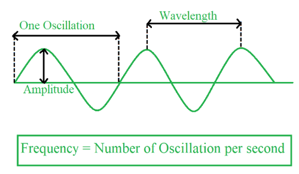
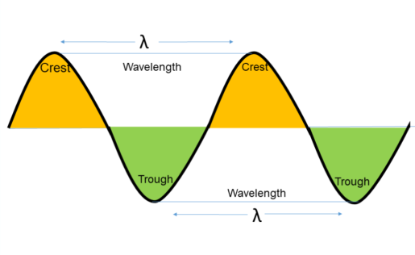
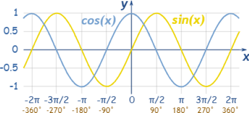

# 📚 Home Work - [21-08-2024] 📅

## 1. Frequency

**Definition:** Frequency (f) is the number of complete cycles of a wave that pass a given point in one second.

**Unit:** Hertz (Hz)



**Formula:**

$$ f = {1 \over T} $$

where:

* f is the frequency in **Hertz (Hz)**
* T is the period in **seconds (s)**

**Table:**

| Frequency (Hz) | Description |
|---|---|
| 1 Hz | One cycle per second |
| 1 kHz | One thousand cycles per second (1000 Hz) |
| 1 MHz | One million cycles per second (1,000,000 Hz) |
| 1 GHz | One billion cycles per second (1,000,000,000 Hz) |

## 2. Wavelength

**Definition:** Wavelength (λ) is the distance between two consecutive corresponding points on a wave, such as two crests or two troughs.

**Unit:** Meters (m)



**Formula:**

$$ \lambda = {v \over f} $$

where:

* λ is the wavelength in **meters (m)**
* v is the wave speed in **meters per second (m/s)**
* f is the frequency in **Hertz (Hz)**

## 3. Sine and Cosine Curves

Sine and cosine curves are periodic functions that represent the oscillations of a wave.

**Visualization:**



**Relationship:**

The sine and cosine curves are shifted versions of each other. A cosine curve is simply a sine curve shifted by π/2 radians to the left.

**Mathematical Representation:**

* **Sine Wave:**

$$
\displaystyle
y = A \cdot sin(\omega t + \phi)
$$

* **Cosine Wave:**

$$
\displaystyle
y = A \cdot cos(\omega t + \phi)
$$

where:

* A is the amplitude (maximum displacement from the equilibrium position)
* $\omega$ is the angular frequency (2πf)
* t is time
* $\phi$ is the phase shift

## 4. What is Hertz (Hz)?

Hertz (Hz) is the unit of frequency. It represents the number of cycles per second.

**1 Hz:** One cycle per second.

**1 GHz:** One billion cycles per second.

## 5. Summation of an Arithmetic Progression (AP)

**Definition:** An arithmetic progression is a sequence of numbers where the difference between any two consecutive terms is constant. This constant difference is called the common difference (d).

**Formula:**

```math
S_n = {n \over 2} \; [2a + (n-1) \cdot d]
```

where:

* $S_n$ is the sum of the first n terms
* n is the number of terms
* a is the first term
* d is the common difference

**Derivation:**

The sum of an AP can be derived by pairing the first and last term, the second and second-to-last term, and so on. Each pair sums to (a + l), where l is the last term.

Since there are $n \over 2$ pairs, the sum is:

$$
S_n = {n \over 2} \space (a + l)
$$

We can express the last term (l) as:

$$
l = a + (n-1) \cdot d
$$

Substituting this into the sum formula gives:

```math
S_n = {n \over 2} \; [2a + (n-1) \cdot d]
```

## 6. Summation of a Geometric Progression (GP)

**Definition:** A geometric progression is a sequence of numbers where the ratio between any two consecutive terms is constant. This constant ratio is called the common ratio (r).

**Formula:**

$$
S_n = {a \cdot (1 - r^n) \over (1 - r)}
$$

where:

* $S_n$ is the sum of the first n terms
* a is the first term
* r is the common ratio
* n is the number of terms

**Derivation:**

The derivation involves multiplying the sum by the common ratio and subtracting the original sum. This leads to a cancellation of terms, allowing us to solve for the sum.

**Note:** This formula is valid only when r $\ne$ 1. If r $=$ 1, the sum is simply $n \cdot a$.
